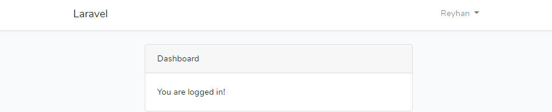

# LBE-RPL[1] | Laravel - Auth & Middleware

## Autentikasi
Pada laravel 7 suda tersedia by default untuk autentikasi
```shell
composer require laravel/ui
php artisan ui vue --auth
php artisan ui react --auth
php artisan ui bootstrap --auth
```
___
Setelah memilih UI yang diinginkan jalankan:
```shell
npm install && npm run dev
```
___
### [Source](https://github.com/mhmudyns/laravel-multi-auth-tutorial)


